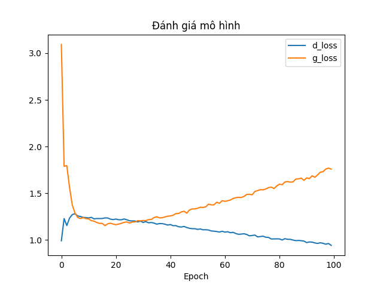

# Generative AI
## Yêu cầu
- Python
## Cách sử dụng
- Cài đặt các thư viện cần thiết
```bash
pip install -r requirements.txt
```
- Tải dữ liệu từ kaggle
```bash
python src/get_data.py
```
- Huấn luyện mô hình
```bash
python src/train_model.py
```
- Kiểm tra mô hình đã huấn luyện
```bash
python src/test_model.py
```
## Ghi chú
- Các mô hình sẽ được lưu lại sau mỗi 10 epoch ở thư mục [models](./models/)
- Các ảnh sau khi kiểm tra mô hình sẽ được lưu thư mục [images](./images/)
- Số epoch và learning rate của generator và discriminator nằm ở file [src/setting.py](./src/setting.py)
- Kết quả huấn luyện sau 100 epoch


